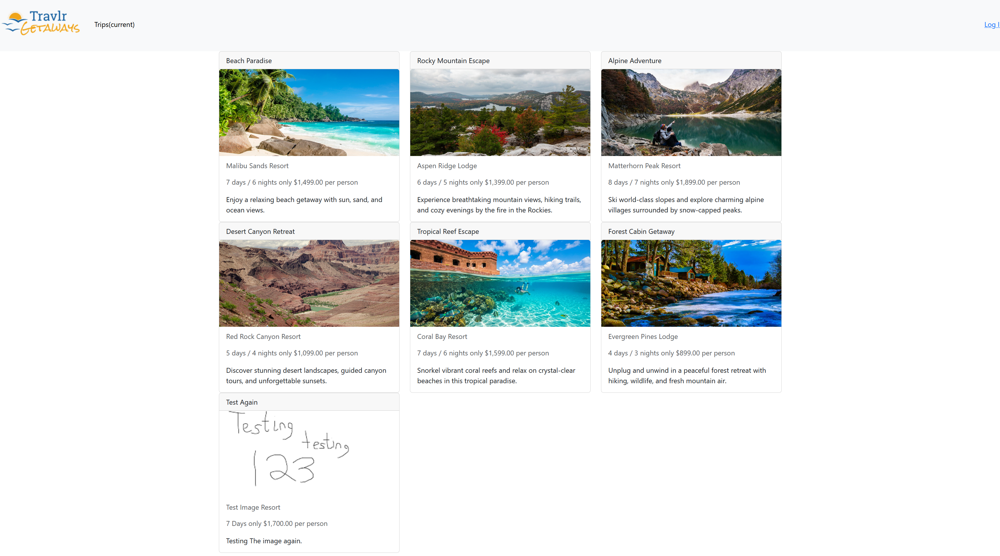
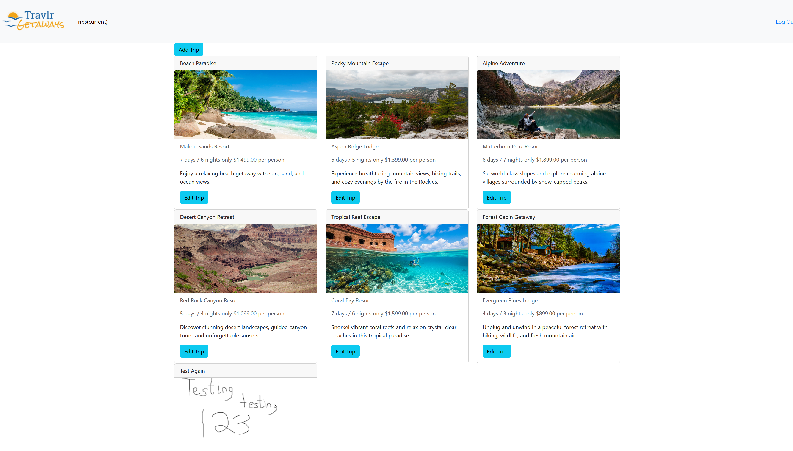
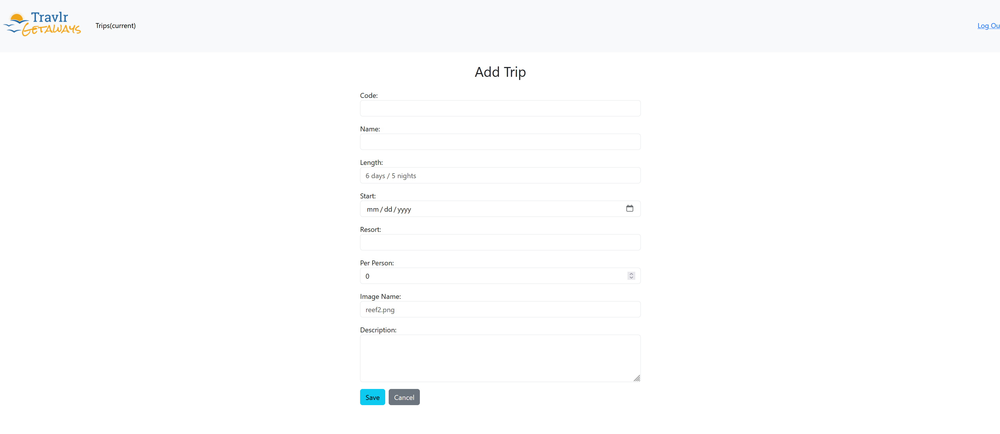

**Quick Links:**  
[Self-Assessment](#professional-self-assessment) | 
[Project](#project-overview) | 
[Enhancements](#artifact-enhancement-breakdown) | 
[Code Review](#code-review)

This repository contains my Capstone ePortfolio for SNHU's Computer Science program. It showcases enhancements made to a full-stack travel application originally developed in CS465.

This project demonstrates my ability to design, enhance, and secure a full-stack application, while focusing on practical functionality and improvements that would matter in a real-world environment.

## Project Overview
The application is a full-stack web system built using MongoDB, Express.js, Angular, and Node.js. It allows users to view and manage travel packages, including details such as destination, duration, and pricing.

## Enhancements Implemented
- Implemented JWT-based authentication for secure user access  
- Improved API structure and overall application organization  
- Enhanced database functionality and validation  
- Added filtering, searching, and sorting for trip data  

## Repository Structure
- enhanced_artifact/ → Final enhanced version of the application  
- original_artifact/ → Original version prior to improvements  
- docs/ → Supporting documentation, including artifact narrative

## Application Screenshots

### Public View

### Logged-In View

### Add/Edit Trip

## Code Review Video
[Watch Code Review Video](https://drive.google.com/file/d/11BzI5ACGvns91VQyWdrRiCKziUaAEe38/view?usp=sharing)

## Author
Jonathan Harris
